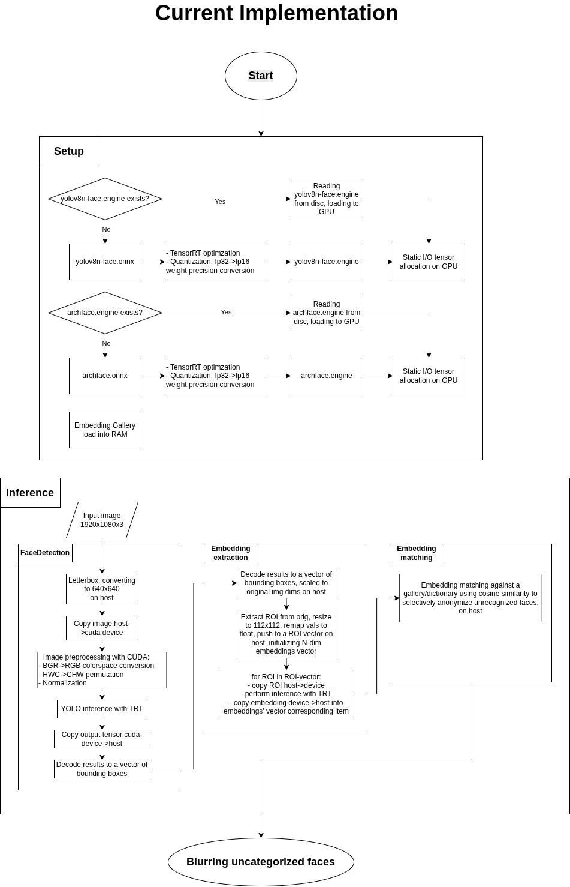

# Q1 

## Question answers

### 1. How can we improve face detection by adding reidentification to anonymize only specific individuals while keeping computational cost low?

For this kind of face detection pipeline, a YOLO-type model for detection and a lightweight re-identification embedding model can be selected. The core idea is to run the heavy detection only once per frame, then use faster embedding comparisons to decide whether a detected face matches a target identity that shouldn't be anonymized.

The detection stage uses a YOLO model (in the example implementation below [YOLOv8n-face](https://github.com/lindevs/yolov8-face/tree/master) was used) to produce bounding boxes each frame. For each detected face crop, a small and fast embedding model (f.e. [archface](https://huggingface.co/garavv/arcface-onnx
) which was used in the example implementation) extracts a vector that captures the identity of the face. These embeddings are then compared against a pre-built gallery of target identities using cosine similarity (or any other identity metric such as L1, L2 distance or dot product) — if the score clears a certain threshold, you anonymize it.

To optimize computations and reduce memory bandwidth a few strategies might be applied:

- Running ReID only on frames where YOLO reports a detection, skipping the frames without faces .
- Use a tracking algorithm such as SORT/ByteTrack or to propagate identities across frames — once a track ID is matched to a target, subsequent frames in that track skip ReID and apply the anonymization directly until the track is lost. 
- Use batching when performing ReID inference, in order to feed the model input a set of ROIs
- Downscale face ROI crops to 64×64 or 112×112 before passing them to the ReID model, which has a negligible effect on matching accuracy but substantially cuts inference time.
- Quantize the models' weights from default FLOAT32 to FLOAT16 or INT8 types. If the GPU occupancy allows, it can be useful to saturate GPU utilization to achieve faster framerate through multithreading/threadpools and frame buffering, running detection/ReID inferences and embedding matching in parallel. This might add additional multiple frames delay, however increase the overall system's framerate. 
- Reduce data movement and copying between CUDA device and host, utilize zero-copy techniques and circular buffering where possible, use optimal inference frameworks (f.e. TensorRT) that allow to perform model optimization (such as layer fusion, kernel autotuning, precision calibration, constant folding etc.) and CUDA-graphs to reduce kernel launches overhead and driver API calls.
- Build the embedding gallery offline from a small set of reference images of each target person. 

With these optimizations combined, the pipeline can achieve real-time performance on commodity GPU hardware while remaining compliant with privacy requirements and being modular with further opportnities to add certain features.


### 2. How can we extend an anonymization pipeline with depth-based filtering to blur only background objects efficiently?

Since the architecture described in the question above can be considered modular and utilizes CUDA-accelerated inferencing and multithreading, depth estimation can be added to a threadpool to run in parallel alongside the existing detection+ReID tasks, both consuming the same input frame, can be achieved through buffering+threadpools of worker threads:

1. Frame N arrives. The detection+ReID branch is dispatched to one worker thread, depth estimation to another. Both results are written into the corresponding slot in the circular buffer.
2. Frame N+1 arrives. Both branches are dispatched again for the new frame. Simultaneously, a compositor worker picks up the completed results from frame N's buffer slot, merges the face anonymization mask and depth mask, and writes the final composited frame to the output.

Job assignment to different threads might change (depending which part is the latency bottleneck), but the general idea remains the same.

Thread A: FaceDetector -> EmbeddingExtraction -> selective face anonymization

Thread B: DepthEstimationModel -> depth map -> background mask

Compositor: Applying background blur using the background mask and face blur -> composed output frame

For such a task there might be no need to run depth estimation inference on a high resolution image, so the input image may be downscaled. This might help to reduce the computations significantly, if the resulting depth map resolution is sufficient for accurate background separation.

Some additional post-processing can be applied to depth map, such as normalization, gaussian blur to mask the edges and make them smoother, and adjustable thresholding which selects which depth level is considered background.


### 3 && 4. Imagine we have this case: our face detection system does not detect properly (bad accuracy) dark-skins nor bald-people; how would you improve system accuracy? Imagine this other case: let's assume we have added several bald people imagery to our dataset and we still are not increasing the accuracy. What may be happening? How would you fix this?

Since I'm more focused on the production and infrastructure side, I'm not the deepest expert on model training and dataset curation, but based on my previous experience working with datasets and model fine-tuning, my first thought is to look at data underrepresentation.

The model was most likely trained on datasets that don't contain enough examples of dark-skinned and bald individuals, so it never learned to detect them reliably. The fixes I'd explore first:

- Expand the training dataset with more examples of the affected groups across varied lighting, angles, conditions and backgrounds.
- Take a look at annotation quality.
- Oversample underrepresented subgroups during training so they contribute meaningfully to the loss rather than being drowned out by the majority class.
- Apply targeted augmentation to synthetically increase diversity without requiring more labeled data, such as contrast/brightness reduction, artificial top-cropping to force model to learn to detect lower-part features of the face.
- After any changes, evaluate per subgroup rather than just overall accuracy, since aggregate metrics can easily mask failures on minority groups.


### 5. Which MLOPs infrastructure would you design to manage this system? Just provide a high-level design and which tools would you use.

For a real-time system including DNN inferencing the infrastructure and lifecycle can be divided in two parts: 

1. Infrastructure for model training, experiment tracking and dataset management.
2. Model deployment into production.

For the research, training and experiment stage:

- DVC for dataset versioning - every model must be traceable to the exact dataset version it was trained on.
- ClearML covers the full training lifecycle: logs hyperparameters, metrics and artifacts per experiment, hosts a model registry with stage promotion (development -> staging -> production), and orchestrates training pipelines. Before a model is promoted to staging, an automated fairness gate evaluates per-subgroup detection metrics - models failing the defined thresholds are rejected automatically.
- Github Actions - triggers on a certain signal from ClearML pipeline, can start production deployment.

For the production stage it all starts from Github Actions, CI/CD pipeline is triggered here.

- Staged models can be converted to the required format, optimized, quantized etc. after which additional automated performance (or even accuracy) benchmarks on target hardware can be performed if needed. After all the checks pass, the models can be deployed into the production server running the application. Rollback capability should always be taken into account - a canary rollout strategy is recommended, gradually shifting traffic to the new model version and only completing the cutover once production metrics are stable.
- After all the ML-related checks pass and models are verified, there's also another important step - regression testing, to make sure that the new models are compatible with the code and nothing accidentally broke. (e.g. I/O size has changed, additional pre/post processing is required in the new version of model)
- The application side should also be covered with unit/integration tests. The system should run in a versioned Docker image, versioned according to its contents, which also simplifies rollback to a previous state in case something goes wrong.
- Post-deployment and runtime metrics: Prometheus/Grafana for server performance and inference metrics. Additionally, Evidently AI can monitor incoming data distribution and model confidence scores against a training baseline, detecting drift and triggering a retraining signal back to the ClearML pipeline when thresholds are exceeded - closing the feedback loop between production and training.
- Inference events should be logged immutably (timestamp, model version, detection count, anonymization decisions - never actual face crops) in write-once storage such as S3 with Object Lock.
- Vector databases can be used for embedding storage. 

In general, AWS S3 storage can be also used as a bucket for all the necessary data for both stages.


### 6. From end user POV, which techniques would you use to improve final solution user experience?

End user experience here can be improved across two dimensions: visual quality of the anonymization output, and operator-facing tooling.


Visual quality:
- Temporal stabilization: bounding boxes from a detector naturally jitter frame-to-frame, causing the anonymized region to flicker. Applying an exponential moving average on bounding box coordinates across frames smooths this out significantly.
- Anonymization style selector: let operators choose the anonymization method (Gaussian blur, pixelation, solid mask) depending on the use case and aesthetic requirements.
- Graceful degradation: if the inference server goes down, default to full-frame blur with a visible indicator rather than no anonymization at all.

Operator-facing tooling:
- Access control: the control panel should have role-based access, separating who can view the feed, who can modify anonymization policies, and who can manage enrolled identities.
- Live preview mode: before committing a new anonymization policy, operators should be able to see a real-time side-by-side preview (original vs. anonymized) on the sample feed.
- Configurable thresholds via UI: expose detection confidence and similarity thresholds as interactive controls with live feedback, rather than requiring config file edits.
- Identity enrollment UI: a clear interface for adding or removing individuals from the anonymization exemption policy.
- Input/output management: operators should be able to configure input sources (camera feeds, video files, streams) and output destinations (recording, streaming endpoint, display) through the UI without touching the underlying system configuration.
- Monitoring dashboard: real-time coverage metrics showing percentage of faces anonymized, anomaly alerts with explainability, and per-subgroup fairness metrics updated regularly.
- Single-click compliance export.


### 7.(EXTRA) Provide a code snippet (practical example) on how would you implement any of these applications: reidentification or depth estimation, for face anonymization.

Here I decided to demonstrate an approach I would have used for reidentification task showcasing my technical stack and system design patterns.

This sample application is written in C++20 on ubuntu 24.04 using TensorRT framework for model optimization and inference, some additional pre-processing functions are written in CUDA C to showcase an example of preprocessing data pipeline on GPU. 

It takes an input sample image and performs 50 iterations with [YOLOv8n-face](https://github.com/lindevs/yolov8-face/tree/master) for face detection and [archface](https://huggingface.co/garavv/arcface-onnx) for embedding extraction, both quantized to FP16 weight type to reduce the computations, embedding matching is performed on CPU using cosine similarity searching for correspondences in a JSON dictionary. 

First 15 iterations are warmup, the saved result is from the last iteration, written into resources directory. The first application launch converts the .onnx models into .engine format that are reused in the next application launches, as well as person0 class is written into the gallery.json at the first launch for the sake of example and matching on next launches. 

There's also inference latency benchmark, average latency is printed at the end of runtime. Currently managed to achieve 16.8 ms delay on my laptop's NVIDIA GeForce GTX 1650 (~60 fps). App takes 372mb of statically allocated graphics card memotry and 60% utilization on my device. Deeper SM profiling and GPU performance analysis can be done with Nvidia Nsight profiling tool.

CMake is used for project build, can be deployed and built inside of docker container. Code documentation can be generated using doxygen.

Dependencies:

- OpenCV
- TensorRT 10.8.1
- CUDA 12.8
- FMT
- nlohmann/json


Build docker image:

```
export DOCKER_BUILDKIT=1
docker build . -t pavel/facereid:v1.0.0
```

Create image 

```
docker run --gpus all -e NVIDIA_DRIVER_CAPABILITIES=compute,video,utility -it -d -v /path/to/code/:/workdir/ --network=host --name reid_container pavel/facereid:v1.0.0
```

Can be simply built with ```./build.sh``` inside of docker container.


Diagram of as-is implementation I wrote code for.




Example output log of ```./build/test```:

```
Starting
Model path: /wp/fluendo/artificial-intelligence/ai_model_engineer/Q_1/implementation/onnx/yolov8n-face-lindevs
Engine read successful!
Deserialized engine successfully!
Creating main context
Model bindings:
  Input  0: images, 1x3x640x640, type size: 4
  Output  1: output0, 1x5x8400, type size: 4
Get main bindings
Model path: /wp/fluendo/artificial-intelligence/ai_model_engineer/Q_1/implementation/onnx/arcface
Engine read successful!
Deserialized engine successfully!
Creating main context
Model bindings:
  Input  0: input_1, 1x112x112x3, type size: 4
  Output  1: embedding, 1x512, type size: 4
Get main bindings
Start infer
Mode: VERIFY
Detected 3 face(s)
[0] cx=469 cy=250 w=170 h=229 conf=0.865
[1] cx=1280 cy=233 w=176 h=251 conf=0.862
[2] cx=907 cy=341 w=162 h=212 conf=0.860
Face 0 → person_0 (sim=1.000)
Face 1 → unknown (sim=0.278)
Face 2 → unknown (sim=0.465)
Infer time 16 ms
Detected 3 face(s)
[0] cx=469 cy=250 w=170 h=229 conf=0.865
[1] cx=1280 cy=233 w=176 h=251 conf=0.862
[2] cx=907 cy=341 w=162 h=212 conf=0.860
Face 0 → person_0 (sim=1.000)
Face 1 → unknown (sim=0.278)
Face 2 → unknown (sim=0.465)
Infer time 16 ms
Average infer time: 16.3 ms
```


To generate documentation run
```
doxygen Doxyfile
```

Code style used here is https://google.github.io/styleguide/cppguide.html


Since this is a demonstration application, some parts are not 100% optimal. In a production environment, I would make the following additions and improvements:

- Embedding matching is currently performed on CPU using a simple JSON file. This could be moved to GPU using a small custom TensorRT module or a FAISS function (which i'd avoid because the library is very heavy and hard to build and deploy). The embeddings themselves would be loaded into GPU memory at application startup, with new entries added via a separate thread monitoring a remote database, pulling new data upon enrollment and pushing it to the GPU.
- Letterbox preprocessing can be moved to GPU device, as well as face crops resizing to completely avoid CPU usage. The current Detection->ReID pipeline incurs an unnecessary GPU->host->GPU copy, which could be eliminated.
- Each face ROI is currently inferenced sequentially with ArcFace, because the arcface.onnx model I used does not support batch_size > 1. A custom ONNX model with dynamic shapes could be exported to allow all face ROIs to be inferenced in a single batch, keeping the entire data flow on the GPU. This would likely yield significant speedups and reduce memory bandwidth usage.
- I/O could be handled via a GStreamer pipeline using SRT, RTSP, or RTMP streams, or V4L (Video for Linux) for interprocess communication purposes with external CLI gsteramer pipeline, for continuous frame ingestion and application runtime. Output framerate could also be made continuous to avoid timecode generation issues in the output GStreamer pipeline. Utilize thread-safe containers and multithreading for I/O, avoid dynamic memory allocations by using ring buffers for frame ingestion, in general implement producer-consumer pattern.
- Design model update mechanism without interrupting the feed.
- Unit tests with gtest, CI/CD using github actions, artifacts versioning.