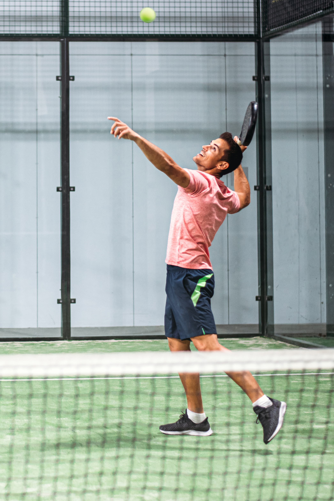

# Pose Estimation for Padel Hits — Analytical Reasoning Test

## Context

You are evaluating a Deep Learning system designed to detect padel hits using **pose estimation** from video. The model predicts player keypoints and derives hit events (forehand, backhand, smash, volley, serve) from body and arm motion. The system is already trained and partially deployed, but several performance and reliability issues have appeared in real scenarios.

  

### Assumptions:
- We want to reduce computational cost so the lighter the models, the better 

### Questions:
1. The model shows strong performance on validation data but fails on new matches recorded in different clubs with different camera heights and angles. Hit detection accuracy drops significantly.
 Explain the most likely root causes of this failure and describe how you would systematically investigate and isolate the problem.

Lets investigate the case when the pipeline looks like this:

YOLO-like detector finds player bounding boxes -> crop passed to pose estimation model -> joint keypoint locations -> sequence of keypoint frames accumulated over time -> motion analysis, classifying hit type

The model was trained on footage from specific cameras at specific positions. It learned what hits look like in that setup. If a camera is placed somewhere else and the same real-world motion looks different in the image - joints appear in different spots, limbs look shorter or longer due to perspective and camera lens distortion, and some joints that were always visible are now hidden or distorted.

Concrete example: a smash recorded from a low side-angle shows the arm extending upward clearly. The same smash from a high corner camera looks completely different - the arm motion is foreshortened and the elbow may be hidden behind the body.

Debugging suggestions:

Split the pipeline into stages and test each one separately on the new footage:

- Verify players detection.
- Joint keypoint position verification.
- Check if classifier still fails when given correct keypoints.
- Collect and record some ground truth data (camera locations, person height, keypoints tightly aligned with actual anatomy), compare it with predictions.

2. After reviewing some samples, you discover that different annotators labeled keypoints slightly differently (especially wrists and elbows), and hit timestamps are sometimes shifted by a few frames.
 Analyze how inconsistent annotations affect both pose estimation and hit classification, how you would detect label-quality problems at scale and how you would decide whether to relabel, filter, or reweight parts of the dataset. Justify your decision criteria.

Timestamp drift may affect hit classification severely leading to false positive/off-timing detections (for example a windup is classified as a hit). Can be debugged by plotting the wrist velocity and checking in which moment the contact occured. If it's consistently a few frames of, the timestamps are drifted.

Labeling variance can lead the model to learn to estimate the average between provided data variants and result in anatomically incorrect keypoint estimation. 

3. Smashes are rare in the dataset but very important for the product. The model often misses them while performing well on common hits.
 Without changing the model architecture, explain which dataset, training, and evaluation strategy changes you would consider. Here, the idea is to discuss tradeoffs and risks of each approach and how you would verify that improvements are real and not overfitting artifacts.

I'll cover this question on a higher level, since I don't have a deep expertise with training strategies for this domain. 

The problem may be class imbalance, the model has seen very few smash examples compared to other hits, so it might lack data to recognize them reliably. So on dataset side it can be improved by collecting more smash examples (if possible) and add some augmentations to existing smash samples.

On evaluation side check smash recall, not only overall accuracy, verify that common hit performance didn't degrade.

4. Two training runs with the same configuration produce noticeably different results. One model is stable but less accurate; another is more accurate but produces jittery keypoints and inconsistent hit timing.
 Provide a reasoning to decide which model is actually better for production. What additional tests, metrics, and scenario-based evaluations would you design to support the decision?

I'll answer this question based on my product and business requirements/features experience. The jittery model's inconsistent hit timing may produce unreliable statistics and event timestamps and any product feature built on top of that (game analysis, highlight detection and statistics) may produce wrong or unpredictable results. Also if jittery keypoints are visible to the user it can damage trust in the product. So the stable model might fail less surprisingly and not produce any garbage output, and if the issues are known, the model may be overfitted to a certain domain or some statistical error can be simply taken into account. Predictible issues may be addresed and discussed with a customer as system's constraints on a specific domain.
The accurate model could be revisited once the source of instability is understood and fixed.

5. Which model would you propose for this application? Why?

For person detection - YOLO-type model

For pose estimation - [rtmpose](https://github.com/open-mmlab/mmpose/tree/main/projects/rtmpose). Relatively fast and fit for real-time performance, can work efficiently both on CPU and GPU. [Paper](https://arxiv.org/pdf/2303.07399) mentions sports analysis as a target use case, and the skip-frame detection + temporal smoothing built into the pipeline directly addresses the jitter problem. Has higher average precision and less computationes than other models mentioned in paper, also can be exported to onnx.